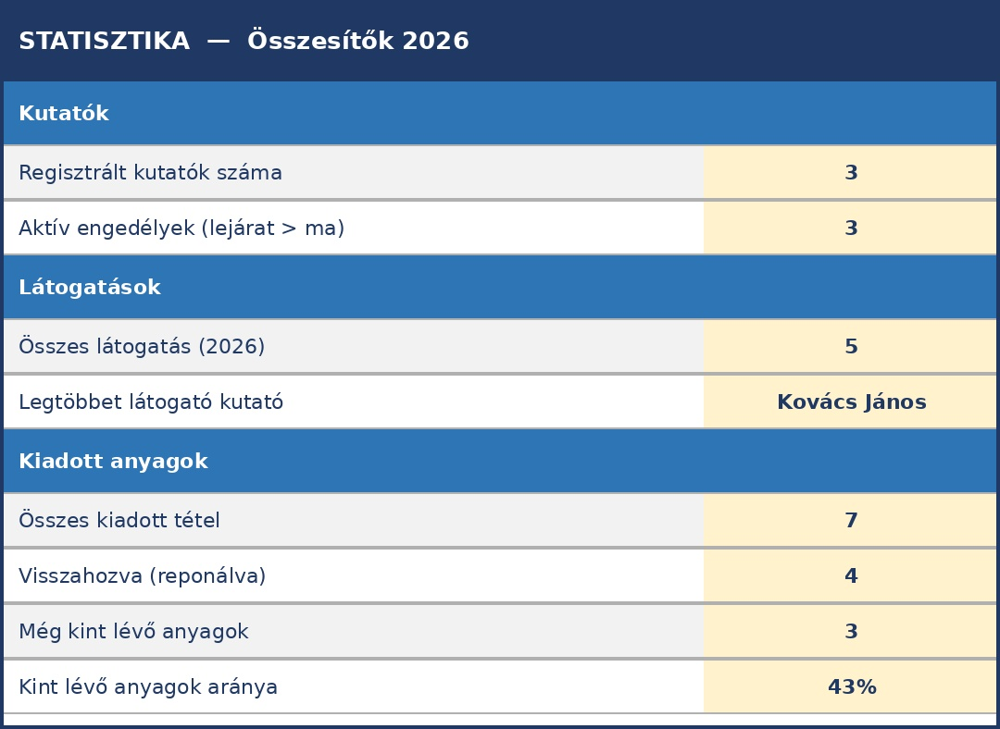

# Összetett példa: Kutatószolgálati nyilvántartás

Az előző fejezetben egyetlen munkalappal dolgoztunk. Most egy valódi levéltári problémát oldunk meg: a kutatószolgálat teljes nyilvántartását Excelben, több egymásra hivatkozó munkalappal.

A kiindulópontot az Evangélikus Országos Levéltár papíralapú nyilvántartási rendszere adja, amely három dokumentumból áll:

- **Kutatói nyilvántartó lap** – a kutató személyes adatai
- **Kutatónapló** – minden belépés rögzítése
- **Kutatott anyagok jegyzéke** – kiadott és visszavett iratok

Ezeket fogjuk digitalizálni és összekapcsolni.

**Letölthető fájlok ehhez a fejezethez**

A fejezet során elkészített munkafüzet két változatban érhető el:

- <Kutatoszolgalat_2026_v2.xlsx> – kész, kitöltött munkafüzet (minden képlettel)
- <Kutatoszolgalat_gyakorlo.xlsx> – gyakorló sablon: az adatok benne vannak, a sárga képlet-cellák üresek – ezeket a fejezet lépései alapján kell kitölteni

---

## A tervezés: Mit tároljunk és hogyan?

Mielőtt egyetlen cellát is kitöltenénk, tervezzük meg a struktúrát.

### Az entitások azonosítása

Kérdezzük meg: **mi az, amiről adatot tárolunk?**

1. **Kutató** – személyes adatok, engedély
2. **Látogatás** – mikor jött, ki engedte be
3. **Kérés** – melyik anyagot kérte, visszahozta-e

Mindhárom entitásnak **saját munkalapot** adunk.

### A kapcsolatok

```
Kutatók ──1:N── Látogatások ──1:N── Kérések
```

- Egy kutató **több alkalommal** is jöhet → 1:N kapcsolat
- Egy látogatáson **több anyagot** is kérhet → 1:N kapcsolat

### A munkafüzet felépítése

| Munkalap | Tartalom | Lapfül színe |
| --- | --- | --- |
| `Kutatók` | Személyes adatok, engedélyek | Sötétkék |
| `Látogatások` | Kutatónapló, belépések | Kék |
| `Kérések` | Kiadott anyagok, visszavétel | Zöld |
| `Statisztika` | Automatikus összesítők | Narancs |
| `Referencia` | Legördülő listák forrása | Szürke (rejtett) |

**Alapelv:** Az adatot **egyszer tároljuk** – a többi lapra FKERES képlettel hivatkozunk. Ha a kutató e-mail-címe megváltozik, csak a `Kutatók` lapon javítjuk – a `Látogatások` és `Kérések` lapon automatikusan frissül.

---

## 1. lépés – A Referencia munkalap

Először hozzuk létre a segédlistákat, amelyekből a legördülő listák táplálkoznak.

1. Kattintsunk a `+` gombra az alsó lapfülsoron – új munkalap jön létre
2. Nevezzük el: `Referencia`
3. Írjuk be az alábbi adatokat:

```
A1: Levéltárosok          B1: Egységek
A2: Horváth Péter         B2: doboz
A3: Szabó Erzsébet        B3: csomó
A4: Kiss Márton           B4: kötet
A5: Fekete Judit          B5: fasciculus
A6: Varga László          B6: téka
```

4. Jobb klikk a lapfülre → **Lapfül színe** → szürke
5. Jobb klikk → **Elrejtés**

**Miért rejtjük el?** A `Referencia` lap technikai segédeszköz – nem adatbevitelre való. Ha látható marad, valaki véletlenül módosíthatja az értékeket, és a legördülő listák elromlanak. Az elrejtett lapot bármikor visszahozhatjuk: jobb klikk bármely lapfülre → **Megjelenítés**.

---

## 2. lépés – A Kutatók munkalap

Ez a **törzsadat-tábla**: minden kutató pontosan egyszer szerepel.

### Fejléc kialakítása

Hozzunk létre egy új munkalapot `Kutatók` névvel. Írjuk be az oszlopneveket az 1. sorba:

```
A1:  Kutató_ID
B1:  Kutatószám
C1:  Név
D1:  Születési_név
E1:  Anyja_neve
F1:  Születési_hely
G1:  Születési_dátum
H1:  Lakcím
I1:  Email
J1:  Telefon
K1:  Foglalkozás
L1:  Munkáltató
M1:  Személyi_ig_szám
N1:  Kutatási_téma
O1:  Engedély_lejárta
P1:  Regisztráció_dátuma
```

Formázzuk meg a fejlécsort:

1. Jelöljük ki A1:P1
2. **Félkövér** + sötétkék kitöltőszín + fehér betűszín + középre igazítás
3. Kattintsunk az **A2** cellára, majd: **Nézet → Ablaktábla rögzítése → Ablaktábla rögzítése**

### Adattípusok beállítása

Az oszlopok típusa nem mindegy:

| Oszlop | Típus | Miért? |
| --- | --- | --- |
| `Kutató_ID` | Szám | Hivatkozási alap – egyedi egész szám |
| `Kutatószám` | **Szöveg** | „K-001/2026” – kötőjel és perjel miatt |
| `Személyi_ig_szám` | **Szöveg** | Vezető nullák (pl. „001234AB”) |
| `Születési_dátum` | Dátum | `ÉÉÉÉ.HH.NN` formátum |
| `Engedély_lejárta` | Dátum | Szűrésnél és a statisztikánál használjuk |

### Adatellenőrzés – Engedély lejárata

Hogy véletlenül se lehessen érvénytelen dátumot beírni:

1. Jelöljük ki **O2:O200**
2. **Adatok → Adatellenőrzés**
3. Engedélyezés: **Dátum** | Adatok: **nagyobb, mint** | Dátum: `2020.01.01`
4. Hibajelzés: „Az engedély lejárata 2020 utáni dátum kell legyen!”

### Mintaadatok bevitele

| Kutató\_ID | Kutatószám | Név | … | Engedély\_lejárta |
| --- | --- | --- | --- | --- |
| 1 | K-001/2026 | Kovács János | … | 2026.12.31 |
| 2 | K-002/2026 | Nagy Anna | … | 2026.06.30 |
| 3 | K-003/2026 | Tóth Béla | … | 2026.09.15 |

A kész `Kutatók` munkalap (a legfontosabb oszlopok látszanak):


Ábra 8.1: A Kutatók munkalap – minden kutató egyszer, egy sorban

**Mentés:** Ctrl+S

---

## 3. lépés – A Látogatások munkalap

Ez a digitális **kutatónapló** – minden belépés egy sor.

### Fejléc

```
A1: Látogatás_ID
B1: Kutató_ID
C1: Kutató_neve          ← FKERES tölti ki!
D1: Kutatószám           ← FKERES tölti ki!
E1: Dátum
F1: Kiadó_levéltáros
G1: Megjegyzés
H1: Engedély_lejárta     ← FKERES tölti ki!
I1: Kért_tételek_száma   ← DARABHA tölti ki!
J1: Kutató_email         ← FKERES tölti ki!
K1: Kutató_intézmény     ← FKERES tölti ki!
```

A C, D, H, I, J, K oszlopok fejlécét jelöljük meg sárga kitöltőszínnel – ezek képlet-oszlopok, nem kézzel töltjük ki.

### A FKERES képletek beállítása

Kattintsunk a **C3** cellára, majd az **fx** gombra (függvényvarázsló). Keressük meg az FKERES függvényt és töltsük ki a négy mezőt:

**Kutató neve (C3):**

```
=HAHIBA(FKERES(B3;Kutatók!$A:$C;3;0);"– nincs találat –")
```

| Mező | Érték | Magyarázat |
| --- | --- | --- |
| Keresési\_érték | `B3` | A Kutató\_ID, amit keresünk |
| Tábla\_tömb | `Kutatók!$A:$C` | A Kutatók lap A–C oszlopai |
| Oszlop\_index | `3` | A 3. oszlop = C = Név |
| Tartomány\_keresés | `0` | Pontos egyezés |

**Kutatószám (D3):**

```
=HAHIBA(FKERES(B3;Kutatók!$A:$B;2;0);"")
```

**Engedély lejárta (H3):**

```
=HAHIBA(FKERES(B3;Kutatók!$A:$O;15;0);"")
```

**Kért tételek száma (I3)** – hány anyagot kért ezen a látogatáson (a Kérések lapból):

```
=DARABHA(Kérések!$B:$B;A3)
```

**Kutató e-mail (J3):**

```
=HAHIBA(FKERES(B3;Kutatók!$A:$I;9;0);"")
```

**Kutató intézménye (K3):**

```
=HAHIBA(FKERES(B3;Kutatók!$A:$L;12;0);"")
```

A képleteket másoljuk le az összes adatsorra (fogjuk meg a C3 cella jobb alsó sarkát és húzzuk le).

**A HAHIBA függvény szerepe:**

```
=HAHIBA(képlet; ha_hiba_akkor_ez)
```

Ha a FKERES nem talál egyező `Kutató_ID`-t (pl. elgépelték), ne jelenjen meg `#HIÁNYZIK` hibaüzenet, hanem egy értelmes szöveg vagy üres cella. A HAHIBA mindig FKERES köré kerül.

### Legördülő lista – Kiadó levéltáros

1. Jelöljük ki **F3:F200**
2. **Adatok → Adatellenőrzés**
3. Engedélyezés: **Lista**
4. Forrás: `=Referencia!$A$2:$A$6`
5. OK

Most csak a listában szereplő levéltárosok nevét lehet beírni – elgépelés és névalak-eltérés kizárva.

### Mintaadatok

| Látogatás\_ID | Kutató\_ID | Kutató\_neve\* | Dátum | Kiadó |
| --- | --- | --- | --- | --- |
| 101 | 1 | *Kovács János* | 2026.02.10 | Horváth Péter |
| 102 | 2 | *Nagy Anna* | 2026.02.10 | Szabó Erzsébet |
| 103 | 1 | *Kovács János* | 2026.02.17 | Horváth Péter |
| 104 | 3 | *Tóth Béla* | 2026.02.18 | Kiss Márton |
| 105 | 2 | *Nagy Anna* | 2026.03.03 | Szabó Erzsébet |

*\* A dőlt értékek FKERES-sel töltődnek – nem kell kézzel beírni.*

A sárga oszlopok képletekkel töltődnek ki automatikusan:


Ábra 8.2: A Látogatások munkalap – a sárga oszlopok FKERES képletekkel töltődnek

**Mentés:** Ctrl+S

---

## 4. lépés – A Kérések munkalap

Ez a **kutatott anyagok jegyzéke** – minden kiadott doboz/csomó/kötet egy sor.

### Fejléc

```
A1: Kérés_ID
B1: Látogatás_ID
C1: Kutató_neve        ← FKERES (Látogatások lapból)
D1: Dátum              ← FKERES (Látogatások lapból)
E1: Jelzet_fond
F1: Jelzet_állag
G1: Mennyiség
H1: Egység
I1: Visszavéve
J1: Reponálva
K1: Reponáló_levéltáros
L1: Kutató_ID          ← FKERES (Látogatások lapból)
M1: Kutatószám         ← beágyazott FKERES
N1: Kutatási_téma      ← beágyazott FKERES
```

### FKERES képletek

**Kutató neve (C3)** – a Látogatások lapból:

```
=HAHIBA(FKERES(B3;Látogatások!$A:$C;3;0);"")
```

**Látogatás dátuma (D3)** – a Látogatások lapból:

```
=HAHIBA(FKERES(B3;Látogatások!$A:$E;5;0);"")
```

**Kutató\_ID visszakeresve (L3):**

```
=HAHIBA(FKERES(B3;Látogatások!$A:$B;2;0);"")
```

**Kutatószám (M3)** – beágyazott FKERES: először a Látogatások lapból kérjük le a Kutató\_ID-t, majd azzal keresünk a Kutatók lapon:

```
=HAHIBA(FKERES(FKERES(B3;Látogatások!$A:$B;2;0);Kutatók!$A:$B;2;0);"")
```

**Kutatási téma (N3)** – szintén beágyazott FKERES:

```
=HAHIBA(FKERES(FKERES(B3;Látogatások!$A:$B;2;0);Kutatók!$A:$N;14;0);"")
```

**Kétlépéses hivatkozás:** A `Kérések` lap a `Látogatások` lapból kérdezi le a kutató nevét – a `Látogatások` lap pedig a `Kutatók` lapból. Ez a láncolat pontosan a relációs modellt tükrözi: minden adat egyszer tárolódik, a többi tábla csak hivatkozik rá.

### Legördülő listák

**Egység (H3:H200):**

1. Jelöljük ki H3:H200
2. Adatok → Adatellenőrzés → Lista → Forrás: `=Referencia!$B$2:$B$6`

**Reponálva (J3:J200):**

Forrás: `"I,N"` – közvetlenül megadva, nem külön listából.

**Reponáló levéltáros (K3:K200):**

Forrás: `=Referencia!$A$2:$A$6`

### Feltételes formázás – Mi van még kint?

Emeljük ki narancsszínnel a még vissza nem hozott anyagokat:

1. Jelöljük ki **A3:K200**
2. **Kezdőlap → Feltételes formázás → Új szabály**
3. „Képlettel meghatározott cellák formázása”
4. Képlet: `=$J3="N"`
5. Formátum: narancs kitöltőszín → OK

Most minden sor, ahol a Reponálva = „N”, narancsszínnel jelenik meg – azonnal látjuk, mi van még kint.


Ábra 8.3: A Kérések munkalap – zöld: visszahozva, narancs: még kint van

**Mentés:** Ctrl+S

---

## 5. lépés – A Statisztika munkalap

Ez a vezérlőpult – automatikusan frissülő összesítők, amelyeket nem kell kézzel számolni.

### Felépítés

Hozzunk létre egy `Statisztika` nevű munkalapot, és írjuk be az alábbi képleteket:

#### Kutatók

| Cella | Felirat | Képlet |
| --- | --- | --- |
| B3 | Regisztrált kutatók száma | `=DARAB2(Kutatók!A3:A1000)` |
| B4 | Aktív engedélyek (lejárat > ma) | `=DARABHA(Kutatók!O3:O1000;">"&MA())` |

#### Látogatások

| Cella | Felirat | Képlet |
| --- | --- | --- |
| B7 | Összes látogatás | `=DARAB2(Látogatások!A3:A1000)` |
| B8 | Legtöbbet látogató kutató | ld. lent |

#### Kiadott anyagok

| Cella | Felirat | Képlet |
| --- | --- | --- |
| B11 | Összes kiadott tétel | `=DARAB2(Kérések!A3:A1000)` |
| B12 | Visszahozva (reponálva) | `=DARABHA(Kérések!J3:J1000;"I")` |
| B13 | Még kint lévő anyagok | `=DARABHA(Kérések!J3:J1000;"N")` |
| B14 | Kint lévő anyagok aránya | `=HAHIBA(B13/B11;0)` – százalék formátum |

**Függvénynév-eltérések:** A feltételes számlálás függvényének neve verziónként eltérhet.

| Verzió | Függvénynév |
| --- | --- |
| Magyar Excel (régebbi) | `DARABTELI` |
| Magyar Excel 365 | `DARABHA` |
| Angol Excel | `COUNTIF` |

Ha az egyik nevet nem fogadja el az Excel, próbáljuk meg a másikat.

### A MA() függvény

Az aktív engedélyek számításában a `MA()` függvény a mai dátumot adja vissza – ezért ez az összesítő **minden nap automatikusan frissül**, nem kell kézzel módosítani.

```
=DARABHA(Kutatók!O3:O1000;">"&MA())
```

Értelmezés: számoljuk meg azokat a sorokat a `Kutatók` lapon, ahol az `Engedély_lejárta` értéke nagyobb (azaz későbbi), mint a mai nap.

### Az INDEX/HOL.VAN kombináció

A legtöbbet látogató kutató nevének meghatározásához összetettebb képlet kell:

```
=INDEX(Látogatások!C3:C1000;
  HOL.VAN(
    MAX(DARABHA(Látogatások!C3:C1000;Látogatások!C3:C1000));
    DARABHA(Látogatások!C3:C1000;Látogatások!C3:C1000);
    0
  )
)
```

Hogyan működik lépésről lépésre?

1. `DARABHA(C3:C1000; C3:C1000)` – minden névhez megszámolja, hányszor szerepel a listában
2. `MAX(...)` – megkeresi a legnagyobb számot (= legtöbb látogatás)
3. `HOL.VAN(MAX...; tömb; 0)` – megkeresi, hányadik helyen van az a sor, ahol ez a maximum előfordul
4. `INDEX(C3:C1000; ...)` – visszaadja az adott pozícióban lévő nevet



Ábra 8.4: A Statisztika munkalap – minden érték automatikusan frissül

**Megjegyzés:** Az INDEX/HOL.VAN kombináció a FKERES rugalmasabb alternatívája – balra is tud keresni, és nem törik el oszlopbeszúrásnál. Haladóbb Excel-használatban érdemes megismerni.

---

## 6. lépés – A munkafüzet rendezése

### Lapfül-színek beállítása

Kattintsunk jobb egérgombbal minden lapfülre → **Lapfül színe**:

| Munkalap | Szín |
| --- | --- |
| Kutatók | Sötétkék |
| Látogatások | Kék |
| Kérések | Zöld |
| Statisztika | Narancs |
| Referencia | Szürke (rejtett) |

### Lapfülek sorrendje

Ha a lapok nincsenek a megfelelő sorrendben: fogjuk meg a lapfület és húzzuk a kívánt helyre.

### Végső ellenőrző checklist

☐ `Referencia` lap el van rejtve  
☐ Minden képlet-oszlop sárga háttérrel jelölve  
☐ Legördülő listák működnek (Kiadó, Egység, Reponálva, Reponáló)  
☐ FKERES képletek nem adnak `#HIÁNYZIK` hibát (HAHIBA védi őket)  
☐ Feltételes formázás a `Kérések` lapon (narancs = kint lévő)  
☐ Ablaktábla rögzítve mindhárom adatlapon  
☐ A `Statisztika` lapon az összes szám frissül, ha új adatot viszünk fel

---

## Mit mutat ez a példa a papíros rendszerhez képest?

| Feladat | Papíron | Excelben |
| --- | --- | --- |
| Kovács János témája megváltozott | Minden naplósorban javítani | `Kutatók` lapon egyszer javítjuk |
| Kik vannak ma bent? | Végiglapozzuk a naplót | Szűrés: Dátum = ma |
| Mi van még kint? | Végignézzük a kiadási listát | Szűrés: Reponálva = N (narancs sorok) |
| Hány kutató jött idén? | Megszámoljuk kézzel | `=DARAB2(Látogatások!A3:A1000)` |
| Lejár valakinek az engedélye? | Minden lapot megnézünk | `=DARABHA(Kutatók!O:O;"<"&MA()+30)` |

---

## Összefoglalás: Melyik függvényt mikor használtuk?

| Függvény | Hol | Mit csinál itt |
| --- | --- | --- |
| **FKERES** | Látogatások, Kérések | Kutató neve, kutatószám, dátum, email, intézmény behúzása azonosító alapján |
| **HAHIBA** | Látogatások, Kérések | Elrejti a `#HIÁNYZIK` hibát, ha az azonosító nincs meg |
| **DARAB2** | Statisztika | Nem üres cellák megszámlálása (rekordok száma) |
| **DARABHA** | Statisztika, Látogatások | Feltételes számlálás (aktív engedélyek, kint lévő anyagok, kért tételek) |
| **MA()** | Statisztika | Mindig a mai dátumot adja – automatikus napi frissülés |
| **MAX** | Statisztika | Legnagyobb érték megkeresése (legtöbb látogatás) |
| **INDEX / HOL.VAN** | Statisztika | Legtöbbet látogató kutató nevének visszakeresése |

---

## Ellenőrző kérdések

1. Miért érdemes a legördülő listák forrását külön `Referencia` munkalapra gyűjteni?
2. Mit csinál a HAHIBA függvény? Miért fontos FKERES-sel együtt használni?
3. Hogyan hivatkozik a `Kérések` lap a `Kutatók` lap adataira? Hány lépéses a láncolat?
4. Mire jó a `MA()` függvény a statisztikai összesítőkben?
5. Mi a különbség a DARAB2 és a DARABHA függvény között?
6. Miért narancsszínű a feltételes formázásnál a `=$J3="N"` képlet – és miért fontos a `$` a J előtt, de nem a 3 előtt?
7. Milyen adatot nem lehet digitalizálni ebből a rendszerből? (Gondoljunk az eredeti papírlapokra!)
8. Hasonlítsuk össze: mit tudna ez a rendszer Accessben, amit Excelben nem tud?
